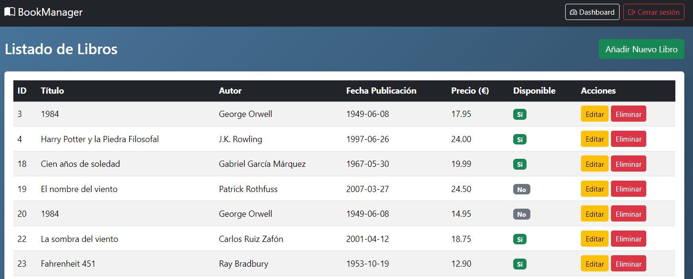
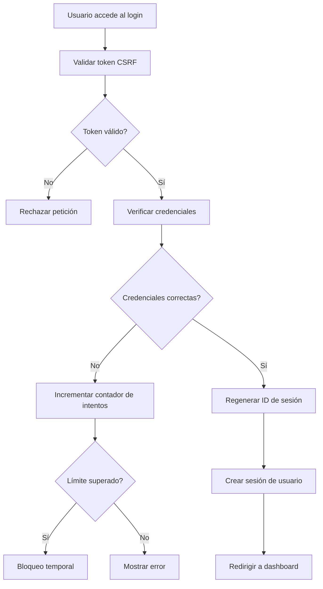

# 📚 BookManager — Sistema de Gestión de Libros


Aplicación web desarrollada en **PHP** siguiendo el patrón **MVC**, que permite gestionar una biblioteca de libros mediante un CRUD completo. Incluye sistema de **autenticación segura**, protección CSRF, control de intentos fallidos y confirmación de eliminación con **SweetAlert2**.

---

## 📑 Tabla de Contenidos

- [Características Principales](#-características-principales)
- [Capturas de Pantalla](#-capturas-de-pantalla)
- [Estructura del Proyecto](#-estructura-del-proyecto)
- [Tecnologías Utilizadas](#️-tecnologías-utilizadas)
- [Instalación](#-instalación)
- [Requisitos](#️-requisitos)
- [Credenciales por Defecto](#-credenciales-por-defecto)
- [Sistema de Autenticación](#-sistema-de-autenticación)
- [CRUD de Libros](#-crud-de-libros)
- [Mejoras Futuras](#-mejoras-futuras)
- [Licencia](#-licencia)

---

## 🚀 Características Principales

### 🔐 Autenticación Segura
- ✅ Validación estricta de usuario y contraseña
- ✅ Protección contra ataques CSRF
- ✅ Regeneración periódica del ID de sesión
- ✅ Control de intentos fallidos de login
- ✅ Hashing seguro con `password_verify()`
- ✅ Prevención de _timing attacks_ mediante hash falso
- ✅ Cabeceras de seguridad (XSS, MIME sniffing, framing)

### 📘 Gestión de Libros (CRUD)
- ✅ **Crear**: Añadir nuevos libros con validación completa
- ✅ **Listar**: Ver todos los libros en formato de tabla responsiva
- ✅ **Editar**: Modificar información de libros existentes
- ✅ **Eliminar**: Borrar libros con confirmación mediante SweetAlert2
- ✅ Validación completa en backend y frontend
- ✅ Sanitización de entradas para evitar XSS

### 🔧 Dashboard Mejorado
- 📊 Estadísticas en tiempo real
- 📚 Tabla de los últimos libros añadidos
- 🎨 Tarjetas informativas con datos relevantes

### 🎨 Interfaz Moderna
- 💅 Diseño basado en **Bootstrap 5**
- 📱 Layout responsive y reutilizable
- 🎯 Tablas interactivas y responsivas
- 🔔 Alertas modernas con **SweetAlert2**

### 🧱 Arquitectura MVC
Separación clara entre:
- **Modelos** → Acceso a datos
- **Controladores** → Lógica de negocio
- **Vistas** → Interfaz de usuario

---

## 📸 Capturas de Pantalla

### 🔐 Login
Pantalla de inicio de sesión con protección CSRF y control de intentos fallidos.


### 📚 Lista de Libros
Vista principal con todos los libros registrados en el sistema.



### ✏️ Editar Libro
Formulario para modificar la información de un libro existente.


### ➕ Crear Libro
Formulario para añadir un nuevo libro al sistema.


---

## 📂 Estructura del Proyecto

```
BookManager/
│
├── 127_0_0_1.sql              # Base de datos SQL
├── index.php                  # Punto de entrada de la aplicación
├── README.md                  # Documentación
├── ayuda.txt                  # Fichero con credenciales de acceso
│
├── config/                    # Configuración
│   ├── auth.php              # Protección de rutas
│   ├── Database.php          # Conexión a base de datos
│   └── establecer-sesion.php # Configuración de sesión
│
├── controllers/               # Controladores MVC
│   ├── AuthController.php    # Autenticación
│   ├── DashboardController.php
│   └── LibroController.php   # CRUD de libros
│
├── models/                    # Modelos de datos
│   ├── Libro.php             # Modelo de libro
│   └── User.php              # Modelo de usuario
│
├── public/                    # Recursos públicos
│   ├── styles.css            # Estilos personalizados
│   ├── validarLibro.js       # Validación de formularios
│   ├── verificaciones.js     # Verificaciones adicionales
│   └── js/
│       └── libros.js         # JavaScript para libros
│
├── views/                     # Vistas de la aplicación
│   ├── crear.php             # Formulario crear libro
│   ├── dashboard.php         # Panel principal
│   ├── editar.php            # Formulario editar libro
│   ├── layout.php            # Layout principal
│   ├── listar.php            # Lista de libros
│   └── login.php             # Página de login
│
└── img/                       # Capturas de pantalla
    ├── login.jpg
    ├── listar.jpg
    ├── editar.jpg
    └── crear.jpg
```

---

## 🛠️ Tecnologías Utilizadas

| Tecnología | Descripción |
|------------|-------------|
| **PHP 8+** | Lenguaje de programación backend |
| **MySQL / MariaDB** | Base de datos relacional |
| **PDO** | Consultas preparadas para prevenir SQL Injection |
| **Bootstrap 5** | Framework CSS para diseño responsive |
| **JavaScript** | Validaciones del lado del cliente |
| **SweetAlert2** | Alertas modernas y elegantes |
| **MVC Pattern** | Patrón de arquitectura de software |

---

## 📦 Instalación

### 1️⃣ Clonar el repositorio
```bash
git clone https://github.com/tuusuario/BookManager.git
cd BookManager
```

### 2️⃣ Importar la base de datos
1. Abre **phpMyAdmin** o tu gestor de MySQL
2. Crea una nueva base de datos llamada `login-php`
3. Importa el archivo `127_0_0_1.sql`

```sql
-- O desde terminal:
mysql -u root -p < 127_0_0_1.sql
```

### 3️⃣ Configurar credenciales de base de datos
Edita el archivo `config/Database.php` con tus credenciales:

```php
private $host = "localhost";
private $db_name = "login-php";
private $username = "tu_usuario";
private $password = "tu_contraseña";
```

### 4️⃣ Configurar servidor local
Coloca el proyecto en la carpeta de tu servidor:

```
XAMPP: C:/xampp/htdocs/BookManager
WAMP: C:/wamp64/www/BookManager
MAMP: /Applications/MAMP/htdocs/BookManager
```

### 5️⃣ Acceder a la aplicación
Abre tu navegador y visita:

```
http://localhost/BookManager/index.php
```

---

## 🖥️ Requisitos

| Requisito | Versión Mínima |
|-----------|----------------|
| PHP | 7.4+ |
| MySQL | 5.7+ |
| Servidor Web | Apache / Nginx |
| Extensión PDO | ✅ Habilitada |
| Navegador | Moderno (Chrome, Firefox, Edge) |

---

## 🔑 Credenciales por Defecto

Para acceder a la aplicación por primera vez, utiliza estas credenciales:

| Campo | Valor |
|-------|-------|
| **Usuario** | `admin` |
| **Contraseña** | `admin123` |

> ⚠️ **IMPORTANTE**: Se recomienda cambiar estas credenciales después del primer inicio de sesión por seguridad.

> 💡 **Nota**: Puedes consultar el archivo `ayuda.txt` en la raíz del proyecto para ver las credenciales actuales.

---

## 🔐 Sistema de Autenticación

El sistema de login implementado está diseñado para ser **seguro, robusto y resistente a ataques comunes**.

### ✅ Contraseñas Seguras

- ✔️ Las contraseñas se almacenan utilizando `password_hash()`
- ✔️ La verificación se realiza mediante `password_verify()`
- ✔️ **Ninguna contraseña se almacena en texto plano**
- ✔️ Resistente a ataques de fuerza bruta y filtraciones

### 🛡️ Protección contra Ataques

#### 🔸 Prevención de SQL Injection
Todas las consultas se realizan mediante **consultas preparadas (PDO)**.

```php
$stmt = $conn->prepare("SELECT * FROM usuarios WHERE username = :username");
$stmt->bindParam(':username', $username);
```

#### 🔸 Prevención de XSS
Los datos del usuario se sanitizan con:
- `htmlspecialchars()` → Convierte caracteres especiales
- `trim()` → Elimina espacios innecesarios

#### 🔸 Prevención de CSRF
Cada formulario incluye un **token CSRF único** por sesión.

```php
$_SESSION['csrf_token'] = bin2hex(random_bytes(32));
```

#### 🔸 Prevención de Fuerza Bruta
- ✅ Contador de intentos fallidos
- ✅ Bloqueo temporal tras múltiples fallos
- ✅ Registro de intentos por IP

#### 🔸 Regeneración de Sesión
Al iniciar sesión correctamente:

```php
session_regenerate_id(true);
```

Esto evita ataques de fijación de sesión.

### 🔄 Flujo de Autenticación



### 🔒 Protección de Rutas

El archivo `config/auth.php` protege todas las rutas del CRUD:

```php
if (!isset($_SESSION['usuario_logueado']) || $_SESSION['usuario_logueado'] !== true) {
    header("Location: index.php?action=login");
    exit();
}
```

✅ Solo usuarios autenticados pueden acceder al CRUD  
✅ Evita accesos directos a controladores o vistas

---

## 🧼 Validación y Sanitización de Datos

Cada formulario del CRUD aplica:

### ✅ Sanitización
- `htmlspecialchars()` → Evita XSS
- `trim()` → Elimina espacios innecesarios
- `floatval()` → Convierte precios a decimal
- `intval()` → Convierte IDs a entero
- Checkbox convertido a `1` o `0`

### ✅ Validación
- ✔️ Campos obligatorios
- ✔️ Fechas válidas (formato Y-m-d)
- ✔️ Precios numéricos positivos
- ✔️ Longitud mínima de texto
- ✔️ Validación en tiempo real con JavaScript

---

## 📘 CRUD de Libros

### ➕ Crear Libro
- Formulario en `views/crear.php`
- Sanitización completa de datos
- Inserción mediante consultas preparadas
- Redirección a listar con mensaje de éxito

### ✏️ Editar Libro
- Carga de datos existentes por ID
- Validación y sanitización
- Actualización segura en base de datos
- Redirección a listar

### 📋 Listar Libros
- Vista en tabla responsive
- Paginación de resultados
- Acciones: Editar y Eliminar

### 🗑️ Eliminar Libro

Eliminación confirmada mediante **SweetAlert2**:

```javascript
function confirmarEliminacion(id) {
    Swal.fire({
        title: '¿Eliminar libro?',
        text: 'Esta acción no se puede deshacer.',
        icon: 'warning',
        showCancelButton: true,
        confirmButtonColor: '#d33',
        cancelButtonColor: '#3085d6',
        confirmButtonText: 'Sí, eliminar',
        cancelButtonText: 'Cancelar'
    }).then((result) => {
        if (result.isConfirmed) {
            window.location.href = "index.php?action=delete&id=" + id;
        }
    });
}
```

---

## 🎨 Estilos y Diseño

El proyecto utiliza:

- 🎨 **Bootstrap 5** → Diseño responsive y componentes modernos
- 💅 **CSS personalizado** → Estilos adicionales en `public/styles.css`
- 🔔 **SweetAlert2** → Alertas elegantes y modernas
- 📱 **Mobile-first** → Optimizado para dispositivos móviles

---

## 🧩 Mejoras Futuras

- [ ] 👥 Roles de usuario (admin/lector)
- [ ] 📄 Paginación avanzada de libros
- [ ] 🔍 Buscador con filtros avanzados
- [ ] 🖼️ Subida de imágenes de portada
- [ ] 🌐 API REST para integración externa
- [ ] 📊 Logs de actividad del usuario
- [ ] 📧 Recuperación de contraseña por email
- [ ] 🌙 Modo oscuro
- [ ] 📚 Categorías y etiquetas para libros
- [ ] ⭐ Sistema de valoraciones

---

## 📄 Licencia

Este proyecto está bajo la licencia **MIT**. Puedes usarlo, modificarlo y distribuirlo libremente.

---

## 👨‍💻 Autor

Desarrollado con ❤️ por **[Tu Nombre]**

---

## 🤝 Contribuciones

¡Las contribuciones son bienvenidas! Si deseas mejorar este proyecto:

1. Haz un **fork** del repositorio
2. Crea una **rama** para tu feature (`git checkout -b feature/nueva-funcionalidad`)
3. Realiza tus **cambios** y haz commit (`git commit -am 'Añadir nueva funcionalidad'`)
4. Haz **push** a la rama (`git push origin feature/nueva-funcionalidad`)
5. Abre un **Pull Request**

---

## 📞 Soporte

Si tienes alguna pregunta o problema:

- 📧 Email: tu-email@ejemplo.com
- 🐛 Issues: [GitHub Issues](https://github.com/tuusuario/BookManager/issues)
- 💬 Discusiones: [GitHub Discussions](https://github.com/tuusuario/BookManager/discussions)

---

<div align="center">

**⭐ Si te ha gustado este proyecto, no olvides darle una estrella ⭐**

Hecho con 💙 usando PHP, MySQL y Bootstrap

</div>
